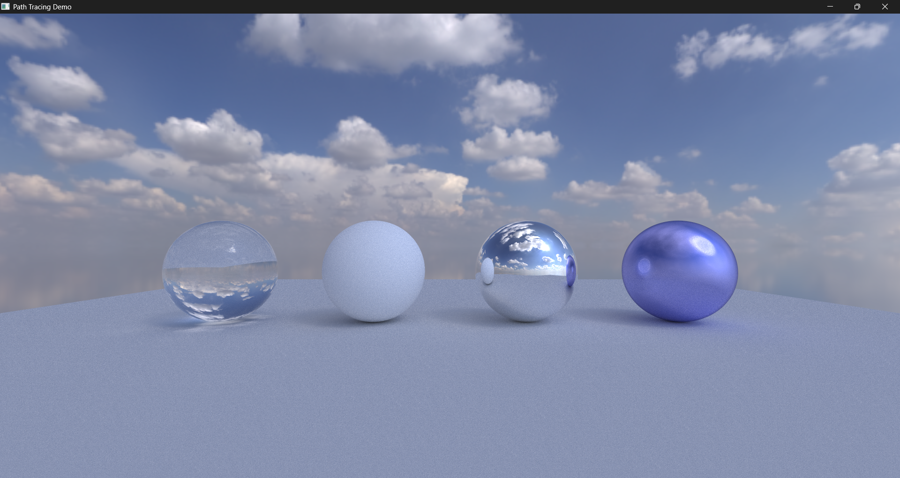
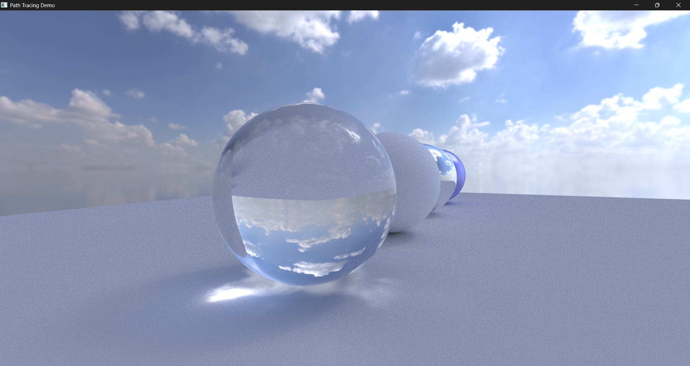
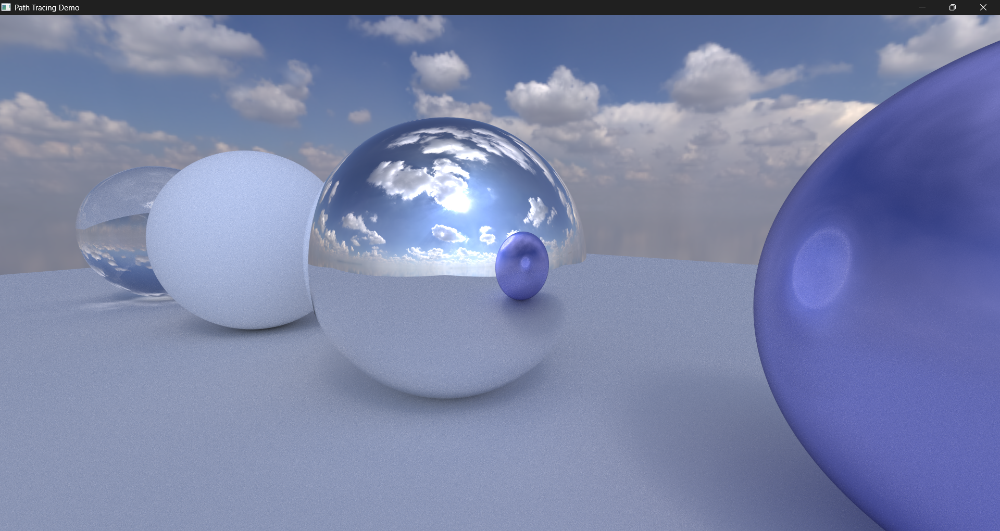

<div align="center">


    <a href="https://www.youtube.com/@playballisticgames" target="_blank" rel="noopener">
    
    </a>

</div>

# Path Tracing Demo

Text

<p align="center">
  <strong>Preview</strong><br>
  
</p>

### Clone Repository
```bash
git clone --recursive https://github.com/marcushcarter/rust-pathtracing.git rust-pathtracing
cd rust-pathtracing
git submodule update --init --recursive
```

**Build & Run**
```bash
# Compile with rust (cargo rustup)
cargo run
```

<p align="center">
  <a href="./.github/assets/glass-closeup.png" title="Glass Closeup (click to enlarge)">
    
  </a>
  &nbsp;&nbsp;
  <a href="./.github/assets/mirror-reflection.png" title="Mirror Reflection (click to enlarge)">
    
  </a>
  <br>
  <small><em>Left: glass closeup — Right: mirror reflection.</em></small>
</p>